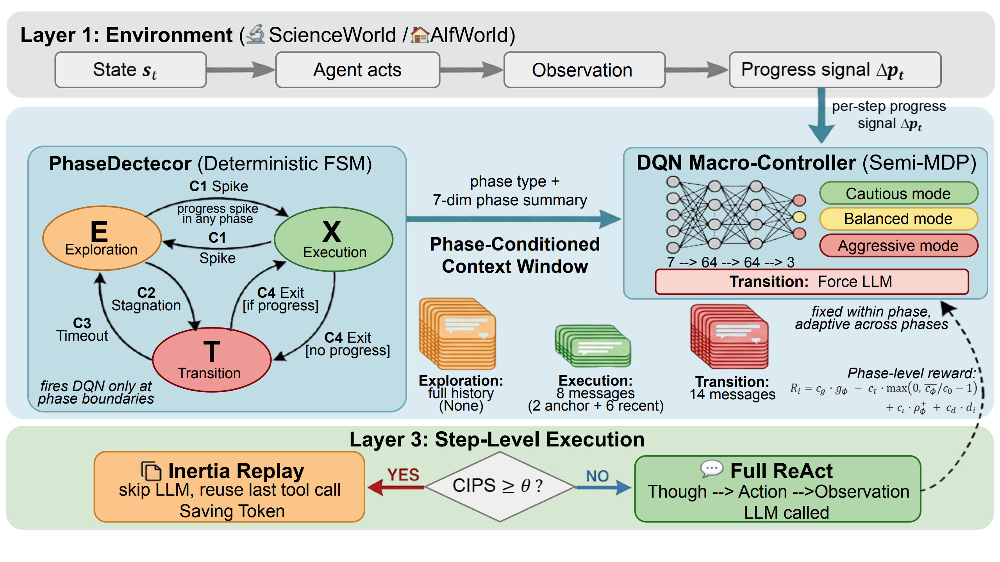

# TEMPO: Tool-Enhanced Multi-Step Planning and Optimization

TEMPO is a practical, AutoTool-style framework for evaluating tool-using LLM agents on AgentBoard tasks such as ScienceWorld and Alfworld.

This repository keeps the same overall workflow as AutoTool, with project-specific updates for configuration, path handling, and evaluation scripts.



## Overview

TEMPO combines:
- LLM-based action generation
- Tool-graph and inertia-based action support
- AgentBoard-style environment evaluation

Main entry points:
- Evaluation script: [agentboard/eval_main.py](agentboard/eval_main.py)
- Main config: [eval_configs/main_results_all_tasks.yaml](eval_configs/main_results_all_tasks.yaml)
- Runtime env file: [autool/.env](autool/.env)
- Env template: [autool/.env.example](autool/.env.example)

## Environment Setup

The environment setup in TEMPO is intentionally aligned with AutoTool.

Please follow the AutoTool README for full environment preparation:
- https://github.com/jiajingyyyyyy/AutoTool

Notes specific to TEMPO:
- Use your TEMPO project root as `PROJECT_PATH`.
- Keep all paths in config/env based on `${PROJECT_PATH}` to avoid hard-coded absolute paths.
- If you run in a constrained container, avoid launching multiple evaluations in parallel.

## Configuration

### 1) Create .env from template

```bash
cd autool
cp .env.example .env
```

Then edit [autool/.env](autool/.env):
- `OPENAI_API_KEY`: your API key
- `OPENAI_BASE_URL`: API endpoint (for DeepSeek, typically `https://api.deepseek.com/v1`)
- `PROJECT_PATH`: absolute path to this repo
- `SIMCSE_MODEL_PATH`: local SimCSE model directory
- `TOOL_DESC_FILE`: should point to `${PROJECT_PATH}/assets`

### 2) Select model/API in YAML

Edit [eval_configs/main_results_all_tasks.yaml](eval_configs/main_results_all_tasks.yaml), section `llm:`.

Example (already available in the file):

```yaml
llm:
    DeepSeekV3:
        name: gpt
        engine: deepseek-chat
        api_base: https://api.deepseek.com/v1
        context_length: 1000000
        use_azure: False
        temperature: 0.
        top_p: 1
        retry_delays: 20
        max_retry_iters: 15
        stop: "\n"
        use_parser: True
```

You can add or modify other providers in this same `llm` block, then choose them with `--model` at runtime.

### 3) Configure task-specific settings

In the same YAML file, section `env:` controls task configs.

Common fields:
- `init_prompt_path`
- `label_path`
- `check_actions`
- `check_inventory`

For ScienceWorld, check [eval_configs/main_results_all_tasks.yaml](eval_configs/main_results_all_tasks.yaml) under `env.scienceworld`.

## How To Run

Run from the project root.

### Example A: ScienceWorld with DeepSeek

```bash
cd /path/to/TEMPO
export PROJECT_PATH=$(pwd)
set -a && source autool/.env && set +a

python agentboard/eval_main.py \
    --cfg-path eval_configs/main_results_all_tasks.yaml \
    --tasks scienceworld \
    --model DeepSeekV3 \
    --log_path ./results/scienceworld_deepseek \
    --project_name evaluate_deepseek_sw \
    --baseline_dir ./data/baseline_results
```

### Example B: Alfworld with DeepSeek

```bash
python agentboard/eval_main.py \
    --cfg-path eval_configs/main_results_all_tasks.yaml \
    --tasks alfworld \
    --model DeepSeekV3 \
    --log_path ./results/alfworld_deepseek \
    --project_name evaluate_deepseek_aw \
    --baseline_dir ./data/baseline_results
```

### Example C: ScienceWorld with GPT-3.5 config key

If your YAML has `gpt-3.5-turbo-16k` configured:

```bash
python agentboard/eval_main.py \
    --cfg-path eval_configs/main_results_all_tasks.yaml \
    --tasks scienceworld \
    --model gpt-3.5-turbo-16k \
    --log_path ./results/scienceworld_gpt35 \
    --project_name evaluate_gpt35_sw \
    --baseline_dir ./data/baseline_results
```

## Practical Tips

- `--model` must match a key under `llm:` in [eval_configs/main_results_all_tasks.yaml](eval_configs/main_results_all_tasks.yaml).
- `--tasks` must match a key under `env:` in [eval_configs/main_results_all_tasks.yaml](eval_configs/main_results_all_tasks.yaml).
- Always source [autool/.env](autool/.env) before running.
- Keep one evaluation process at a time in low-memory containers.

## Troubleshooting

### API returns connection or auth errors

- Confirm `OPENAI_BASE_URL` and `OPENAI_API_KEY` in [autool/.env](autool/.env).
- Check whether proxy variables interfere with API access.

### Model key not found or model does not exist

- Ensure the runtime `--model` name exists in [eval_configs/main_results_all_tasks.yaml](eval_configs/main_results_all_tasks.yaml).
- Ensure `engine` is a valid model ID for your provider.

### Process is killed

- Usually indicates container memory pressure.
- Run one job at a time and reduce concurrent workloads.

## Authors
- [Yanxi Hu](https://github.com/Hlllime)
- Yanjie Zhao
- Jingyi Jia
